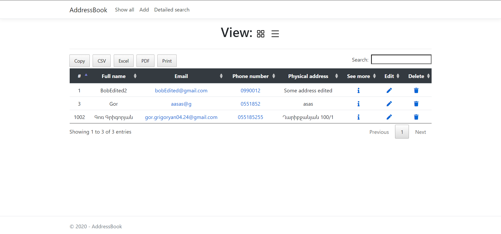

# About application

This web application act as an ```address book.```

## Functionalities

 - Show all addresses
	 - With table
	 - With cards
 - Copy or download all addresses with excel, pdf, CSV or print
 - Detailed search
 - View single address with his QR code
 - Add new address
 - Edit address
 - Delete
 - Custom 404 page not found

## Images



## Prototypes
- [UX prototype](https://www.figma.com/file/Spp7Izo3N3xhnhITjHDHkA/AddressBook?node-id=0:1) 
- [Database prototype](https://drawsql.app/my-doc/diagrams/addressbook)
